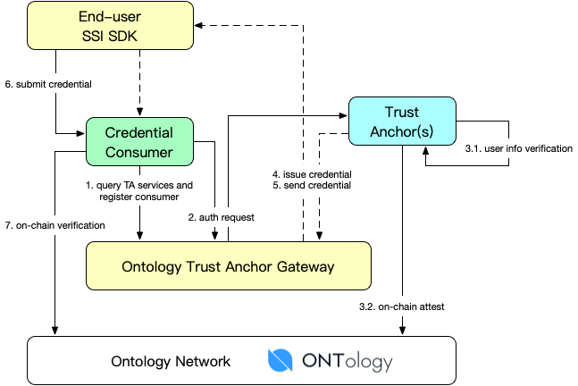

<h1 align="center">ONT TAG认证产品介绍 </h1>

[TOC]

## ONT TAG能为你做什么？

如果您是一个应用平台或开发者，你需要基于ONT ID实名认证您的用户。

ONT TAG基于ONT ID及本体信任生态，是一个开放的、去中心化的认证平台，为人、财、物、事提供丰富的认证服务。本体信任生态已聚集了提供全球身份认证服务能力的信任锚，包括IdentityMind、CFCA、商汤科技、Shufti Pro等等，同时还支持邮箱、手机、社交媒体认证方式。详细[了解本体信任锚](https://ontid.ont.io/verifier)。

ONT TAG具有以下优势：

* 本体信任生态已经连接了全球的认证服务机构，覆盖218个国家的用户，支持多种证件类型；
* 基于本体区块链，所有认证动作和认证结果被区块链存证。
* 规范支持零知识证明等密码学算法，用户可以选择性出示自己的身份信息，最大限度保护用户隐私。

## 开始使用

本文用于指导认证需求方如何接入本体，并使用ONT TAG提供的认证服务，流程中涉及到的参与方包括：

* 认证需求方（Requester）: 需要对人，物，事进行认证的DApp，机构或服务场景，是本体信任生态中认证服务的需求方。
* ONT TAG：基于ONTID及本体信任生态，是一个开放的、去中心化的认证平台，为人、财、物、事提供丰富的认证服务。ONT TAG协同用户和需求方进行数据交换，数据全程被加密，保护用户隐私数据。


### 了解和ONT TAG的交互流程




- 1：ONT TAG提供了公开的认证服务集市，认证需求方可以到ONT TAG平台浏览并选定自己需要的TrustAnchor及其认证服务。认证需求方确认所需的认证服务后，需要到ONT TAG平台注册相关基本信息，包括ONT ID，基本简介，回调地址。
- 2：认证需求方根据TrustAnchor身份认证的要求，将用户数据提交到ONT TAG ,ONT TAG转交给TrustAnchor。
- 3.1：TrustAnchor对用户进行身份认证，完成可信声明签发。
- 3.2：可信声明基本信息链上存证。
- 4：TrustAnchor完成可信声明签发后，将可信声明用用户ONT ID对应的公钥进行端到端加密传输到ONT TAG。
- 5：ONT TAG根据回调地址将认证结果推送到认证需求方。
- 6：认证需求方在区块链上验证数据。

## 接入步骤

### Step 1: 发现认证服务

本体信任生态中的信任源TrustAnchor将认证服务和可信声明模板信息注册到ONT TAG中，ONT TAG对外提供认证服务集市。认证服务集市完全开放，认证需求方可以从ONT TAG的认证服务集市选择自己需要的认证服务。

ONT TAG目前已经对外开放的认证服务包括：

#### 全球身份认证服务  Global Identity Authentication Service

认证模板:

| Credentail Templete Name | Credentail Description | TrustAnchor ONT ID |
| :-----------------: | :----------------: | ------------------ |
|credential:sfp_passport_authentication | 全球用户护照认证   | did:ont:AZxCwjSGtHGRR9LPgPDtFTjiXpHTKkMnui |
|credential:sfp_idcard_authentication   | 全球用户身份证认证 | did:ont:AZxCwjSGtHGRR9LPgPDtFTjiXpHTKkMnui |
|credential:sfp_dl_authentication       | 全球用户驾照认证   | did:ont:AZxCwjSGtHGRR9LPgPDtFTjiXpHTKkMnui |
|credential:sensetime_authentication | 中国用户身份证认证 | did:ont:ARr6ApK24EU7nufND4s1SWpwULHBertpJb |
|credential:idm_authentication | IdentityMinds身份证认证 | did:ont:AZxCwjSGtHGRR9LPgPDtFTjiXpHTKkMnui|

### Step 2: 确定收费模式

使用ONT TAG需要支付一定的费用，ONT TAG目前支持后收费模式，请联系[本体机构合作](contact@ont.io)。


### Step 3:  ONT TAG平台注册

**测试环境请联系[本体机构合作](contact@ont.io)**

认证需求方选定所需的`TrustAnchor`提供的认证服务后，需要到`ONT TAG`平台注册相关信息，主要包括ONT ID，基本简介及回调地址。只有在平台注册过的需求方才会收到后续的可信声明回调推送。


#### 3.1 认证需求方注册API

```json
Host：域名+/v1/auth-requesters
Method：POST /HTTP/1.1
Content-Type: application/json
RequestExample：
{
	"callback_addr": "https://xxx",
	"description": "coinwallet",
	"name": "coinwallet",
	"ontid": "did:ont:AXXxiWCuJXmuPGnsBji4cqWqV1VrKx8nkM"
}

SuccessResponse：
{
	"msg": "Register",
	"code": 0,
	"result": {
		"app_id": "",
		"app_key": ""
	}
}
```


| RequestField  | Type   | Description        | Necessary |
| ------------- | ------ | ------------------ | --------- |
| callback_addr | String | 认证结果回调地址   | Y         |
| description   | String | 认证需求方的描述   | Y         |
| name          | String | 认证需求方的名称   | Y         |
| ontid         | String | 认证需求方的ONT ID | Y         |

> 为保证数据传输安全性，需求方注册的回调接口必须是https+域名形式，同时需求方需保证注册的回调接口高可用性且接受ONT TAG标准的https的post请求


| ResponseField  |  Type  |           Description           |
| :------------: | :----: | :-----------------------------: |
|      msg       | String |              描述               |
|      code      |  int   | 错误码。可参考[错误码字典](xxx) |
| result.app_id  | String |             app_id              |
| result.app_key | String |             app_key             |

> 注册时获取到的app_id，app_key，用于后续Hmac身份鉴权


#### 3.2.认证需求方更新 API

认证需求方可调用该API更新之前注册的某些信息。

- 需要在`Http`请求头带上`Hmac`做身份鉴权。

```json
Host：域名+/v1/auth-requesters/{ontid}
Method：PUT /HTTP/1.1
Content-Type: application/json
RequestExample：
{
	"callback_addr": "https://xxx",
	"description": "coinwallet",
	"name": "coinwallet"
}

SuccessResponse：
{
	"msg": "",
	"code": 0,
	"result": true
}
```


| RequestField  | Type   | Description      | Necessary |
| ------------- | ------ | ---------------- | --------- |
| callback_addr | String | 认证结果回调地址 | Y         |
| description   | String | 认证需求方的描述 | Y         |
| name          | String | 认证需求方的名称 | Y         |

> 为保证数据传输安全性，需求方注册的回调接口必须是https+域名形式，同时需求方需保证注册的回调接口高可用性且接受ONT TAG标准的https的post请求


### Step 4: 向ONT TAG提交认证

认证需求方向`ONT TAG`提交kyc认证所需用户数据，由`ONT TAG`进行路由转发到对应的`TrustAnchor`进行身份认证、可信声明签发、可信声明基本信息存证，并使用端到端加密传输可信声明到`ONT TAG`（是否加密是可选的，由认证时传入的`encryption`加密参数确定）

- **端到端加密传输方案**：若url参数`encryption`指定为`true`，则认证成功后生成的可信声明会由`TrustAnchor`用用户`ONT ID`的公钥进行`ECDSA`加密，在后续传输过程中都是加密后的密文，保证数据隐私性且不被篡改，用户接收到后使用自己的`ONT ID`的私钥才可以解密获取可信声明原文。
- **防刷**：以`owner_ontid`+`credential_context`+`ar_ontid`作为防刷维度。若一个用户提交了某种可信声明认证，该可信声明认证次数+1，认证失败后次数-1。到达某个限制次数后，用户再次提交认证会返回`62001`错误码。
- **可信声明模板**：向`ONT TAG`提交认证时，需传入正确的且匹配的可信声明模板和`TrustAnchor`的`ONTID`，即`credential_context`和`ta_ontid`字段

```json
Host：域名+/v1/kyc-data?encryption=true|false
Method：POST /HTTP/1.1
Content-Type: application/json
RequestExample：
{
	"auth_id": "123345667878780052",
	"ar_ontid": "did:ont:A8V9Kq6te1Fk01KQ3ecqbfbPwrkBFx9P05",
	"ta_ontid": "did:ont:A8V9Kq6te1Fk01KQ3ecqbfbPwrkBFx9P05",
	"owner_ontid": "did:ont:AJua7C6teoFUs2KhRecqbfbPwrF99kHHgj",
	"credential_context": "credential:sfp_idcard_authentication",
	"country": "CN",
	"name": "dwqq",
	"doc_type": "passport",
	"doc_id": "12345678",
	"front_doc": "data:image/jpeg;base64,/9j/4AAQSkZJRgABAQAAkACQAAD...",
	"back_doc": "data:image/jpeg;base64,/9j/4AAQSkZJRgABAQAAkACQAAD..."
}

SuccessResponse：
{
	"msg": "",
	"code": 0,
	"result": true
}
```

| Url RequestField | Type    | Description                                                  | Necessary |
| :--------------: | ------- | ------------------------------------------------------------ | --------- |
|    encryption    | Boolean | true:认证成功生成的可信声明进行加密传输；false：认证成功的可信声明不进行加密传输 | Y         |


| RequestField       | Type                            | Description                                                  | Necessary |
| ------------------ | ------------------------------- | ------------------------------------------------------------ | --------- |
| auth_id            | string 20-255 characters Length | 请求认证编码，由认证需求方保证唯一性。在后续认证流程中只做透传。 | Y         |
| ar_ontid           | string                          | 认证需求方的ONT ID                                           | Y         |
| owner_ontid        | string                          | 用户ONT ID                                                   | Y         |
| ta_ontid           | string                          | TrustAnchor的ONT ID。每个TrustAnchor都会注册自己的ONT ID，ONT TAG根据认证需求方传入的ONT ID及可信声明模板进行认证路由。 | Y         |
| credential_context | string                          | 可信声明模板。                                               | Y         |
| country            | string 2 characters Length      | 两位国家代码，参照ISO 3166-1 alpha-2编码标准。支持的国家及对应的国家编码可查询[更多接口定义文档](specification.md)中的认证支持国家列表。 | Y         |
| name               | string                          | 姓名                                                         | Y         |
| doc_type           | string                          | 证件类型。目前支持三种：护照:passport,身份证:id_card,驾照: driving_license | Y         |
| doc_id             | string                          | 证件编号                                                     | Y         |
| front_doc          | JPG, JPEG, PNG, PDF             | 0MB-16MB 证件照正面的base64编码                              | Y         |
| back_doc           | JPG, JPEG, PNG, PDF             | 0MB-16MB 证件照反面的base64编码                              | Y         |


### Step 5: 获取认证结果

针对认证需求方，`ONT TAG`会根据认证需求方之前注册的回调地址，将认证结果和可信声明推送到认证需求方。使用批量推送模式，一次最大推送50条记录。

- `ONT TAG`回调认证结果时如果出现网络异常会有重试机制，但是认证需求方也需要保证注册的回调地址的高可用性，以便更实时的获取认证结果。

```json
Host：回调地址
Method：POST /HTTP/1.1
Content-Type: application/json
RequestExample：
{
	"total": 10,
	"records": [{
		"id": "123123",
		"auth_id": "2222333213233231231231232323",
		"ar_ontid": "did:ont:A8V9Kq6te1Fk01KQ3ecqbfbPwrkBFx9P05",
		"owner_ontid": "did:ont:Aju0Kq6te1Fk01KQ3ecqbfbPwrkBFx16Mc",
		"ta_ontid": "did:ont:A5BtKqo9e1Fk01KQ3eckFv41wrkBFl09Fq",
		"credential_context": "credential:sfp_idcard_authentication",
		"encrp_origdata": "xxxxxxxxxx",
		"tx_hash": "",
		"description": "",
		"status": 1,
		"encrp_flag": true
	}]
}
```


| RequestField       | Type    | Description                                        | Necessary |
| ------------------ | ------- | -------------------------------------------------- | --------- |
| status             | int     | TA认证结果  1：认证通过，2：认证失败               | Y         |
| auth_id            | String  | 认证需求方认证时传入的认证编号                     | Y         |
| credential_context | String  | 可信声明模板标识                                   | Y         |
| description        | String  | 若认证失败，即失败原因。若认证成功，即可信声明描述 | Y         |
| encrp_origdata     | String  | 认证数据的可信声明。若认证失败，则为空字符串。     | Y         |
| ar_ontid           | String  | 请求方的ONT ID                                     | Y         |
| owner_ontid        | String  | 用户的ONT ID                                       | Y         |
| ta_ontid           | String  | TrustAnchor的ONT ID                                | Y         |
| tx_hash            | String  | 可信声明存证交易hash                               | Y         |
| encrp_flag         | boolean | 加密标识。true：可信声明经过加密 false：未加密     | Y         |
| id                 | int     | id                                                 | Y         |


### 附录

#### 错误码字典

| Field | Type | Description |
| :--- | :--- | :--- |
| 0 | int | SUCCESS. 成功 |
| 61001 | int | FAIL, param error. 参数错误 |
| 61002 | int | FAIL, already exist. 已存在 |
| 61003 | int | FAIL, not found. 未找到 |
| 61012 | int | credential context already exist. 可信声明模板已存在 |
| 61013 | int | credential context not found. 可信声明模板不存在 |
| 61014 | int | trustanchor not match the credential context. Trustanchor和可信声明模板不匹配 |
| 61015 | int | country not match credential context.国家与认证模板不匹配 |
| 62001 | int | authentication request time exceed limit.认证请求次数超限 |
| 62003 | int | FAIL, communication fail.通信异常 |
| 62007 | int | FAIL, need authorization header.需要身份认证Header |
| 62008 | int | FAIL, authorization fail.身份认证失败 |
| 63001 | int | FAIL, inner error.内部异常 |


### HMAC校验

- [参考](../../sample/Demo.java)


### 代码示例

- [Java](../../sample/Demo.java)
- [TS](../../sample/OntIdSignDemo.js)
