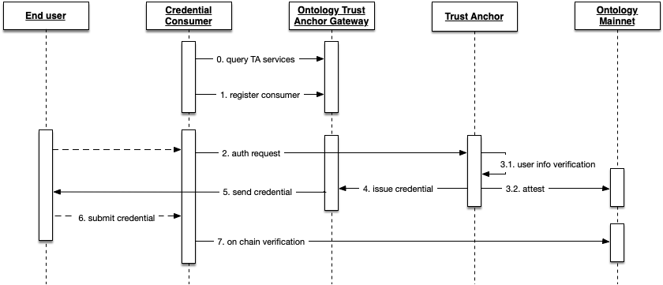

<h1 align="center">KYC服务接入指导 </h1>
<p align="center" class="version">Version 0.9.0 </p>

[TOC]

## 概述

本文用于指导场景需求方如何接入本体，并使用KYC服务，流程中涉及到的参与方包括：

* 场景方（Requester）: 需要对用户进行KYC的机构或服务场景，是本体信任生态中认证服务的使用方。
* ONT TAG：基于本体区块链的去中心化身份交易平台，ONT TAG主要用于协同用户和需求方进行数据交换，数据全程被加密，ONT TAG并不会触碰用户隐私数据。
* ONTO：综合客户端产品[https://onto.app](https://onto.app)，连接了服务全球的身份认证服务供应商，并帮助用户实现认证和自主管理数据。


## 交互流程说明




- A1：场景方到ONT TAG平台注册相关基本信息及回调接口，并选择认证模板。然后按照ONT TAG平台二维码规范生成场景方的认证二维码。
- A2，A3：用户使用ONTO App扫描场景方出示的二维码，获取到二维码信息后向ONT TAG发起认证请求。ONT TAG平台进行二维码校验。
- A4：二维码校验成功，ONT TAG返回场景方注册时的基本信息和认证需求到ONTO App。
- A5：用户在ONTO App上进行授权决策。选择场景方所需的可信声明做授权确认，将加密后的可信声明发送到ONT TAG。ONT TAG触发智能合约进行资产交割。
- A6：ONT TAG通过场景方注册的回调接口，将用户加密后的的可信声明透传到场景方，场景方可使用自己OntId对应的私钥进行解密，获取用户可信声明。
- A7：场景方可通过区块链验证用户出示的可信声明的完整性和有效性。


## 接入步骤


### 1.拥有自己的OntId

首先场景方需要拥有自己的OntId，有了身份OntId相关信息后便可使用各种SDK进行签名验签等操作。OntId签名验签等身份相关操作可参考附录。

测试网OntId可由ONT TAG平台免费代付完成上链注册，直接调用以下API即可完成测试网OntId注册。

```json
Host：https://app.ont.io/S1/api/v1/onttag/thirdparty/ontid
Method：GET /HTTP/1.1
SuccessResponse：
{
	"Action": "RegisterTestNetOntId",
	"Error": 0,
	"Desc": "SUCCESS",
	"Version": "1.0",
	"Result": {
		"OntId": "did:ont:AVdPy51OzyK5MtYyxW4ggFmPCrWQU3VJF2",
		"Salt": "FODMSCkT9YDxyVQXQ61+Nw==",
		"Scrypt-N": 12386,
		"EncryptedPriKey": "a7BCMN9gupQfzfpeJgXJRK3OsO2LITu6xpet5tPyR65LvG4/n1bF+3m2Yy4efGGx",
		"Password": "123456",
		"PrivateKey": "5A5610287B5C6281C6030990D"
	}
}
```

| Param     |     Type |   Description   |
| :--------------: | :--------:| :------: |
|    OntId|   String | OntId |
|    Salt|   String | 盐，安全参数 |
|    Scrypt-N|   int | 加密参数。该参数与后续导入OntId操作相关 |
|    EncryptedPriKey|   String | 加密后的私钥 |
|    Password|   String | OntId私钥密码 |
|    PrivateKey|   String | 私钥 |


主网OntId，推荐使用ONTO客户端 [https://onto.app](https://onto.app) 创建。记住密码并导出keystore，keystore已包含salt，加密后的私钥，OntId等信息。

ONTO导出keystore示例：
```json
{
	"scrypt": {
		"r": 8,
		"p": 8,
		"n": 4096,
		"dkLen": 64
	},
	"address": "AYMKcyx1EuY6o7qqMX17DCPbwmsFpQSoAx",
	"parameters": {
		"curve": "secp256r1"
	},
	"credentialArray": [
    "...",
    "..."
  ],
	"label": "xxx",
	"type": "I",
	"algorithm": "ECDSA",
	"key": "rnE6WclHSS9tpHGp01KQOM10NzeZt4lvlOOOQC8ht9N0x7d1jkjccP9Ay3qQmStT",
	"salt": "UyDgxiZs1StSBkqTmynRJg=="
}
```

| Param     |     Type |   Description   |
| :--------------: | :--------:| :------: |
|    scrypt.n|   int | 加密参数。该参数与后续导入OntId操作相关 |
|    key|   String | 加密后的私钥 |
|    salt|   String | 盐，安全参数 |
|    address|   String | OntId后缀地址。加上did:ont: 即完整的OntId |

若场景方已拥有数字资产账户且持有至少0.01个ONG，也可直接使用各种SDK自行自付创建OntId，获取OntId相关信息。


### 2. ONT TAG平台注册

场景方拥有自己的OntId后需要到ONT TAG平台注册场景方相关信息。

ONT TAG根据本体生态中各种认证服务提供商TrustAnchor可签发的可信声明，提供了不同类型的[标准认证模板](./templete.md)。
Q：什么是认证模板？
A: 认证模板用于设定需要哪些用户信息，认证模板包括认证模板标识、类型、描述，对应的可信声明模板标识，授权逻辑规则，单价等。

场景方需要选择标准认证模板，也可以根据自己的业务需求，自由组合各种可信声明并制定基本的授权逻辑规则，生成自定义的认证模板。然后调用场景方注册API进行登记注册，主要包括场景方基本信息、认证模板标识及回调接口等信息。


#### 场景方注册API

```json
Host：https://app.ont.io/S1/api/v1/onttag/thirdparty?version=0.8
Method：POST /HTTP/1.1
Content-Type: application/json
RequestExample：
{
	"OntId": "did:ont:Assxxxxxxxxxxxxx",
	"NameCN": "COO",
	"NameEN": "COO",
	"DesCN": "COO 区块链",
	"DesEN": "COO Blockchain",
	"Logo": "https://coo.chain/logo/coo.jpg",
	"KycCallBackAddr": "https://coo.chain/user/authentication",
	"KycAuthTemplate": "authtemplate_kyc01",
	"Signature": "AXFqy6w/xg+IFQBRZvucKXvTuIZaIxOS0pesuBj1IKHvw56DaFwWogIcr1B9zQ13nUM0w5g30KHNNVCTo14lHF0="
}

SuccessResponse：
{
	"Version": "0.8",
	"Action": "RegisterThirdParty",
	"Error": 0,
	"Desc": "SUCCESS",
	"Result": true
}
```

| UrlParam     |     Type |   Description   |
| :--------------: | :--------:| :------: |
|    version|   String | 版本信息。目前是0.8 |


| RequestField     |     Type |   Description   | Necessary|
| :--------------: | :--------:| :------: |:----:|
|    OntId|   String|  场景方OntId  | Y|
|    NameEN|   String|  场景方名称，英文  | Y|
|    NameCN|   String|  场景方名称，中文  |Y|
|    DesEN|   String|  场景方描述，英文  |Y|
|    DesCN|   String|  场景方描述，中文  |Y|
|    Logo|   String|  场景方Logo的url链接。logo要求：115*115像素，PNG格式  | Y|
|    KycCallBackAddr|   String|  回调地址。满足https+域名，接收post回调请求 | Y|
|    KycAuthTemplate|   String|  场景方选择的标准认证模板标识。该认证模板由ONT TAG提供。 | Y|
|    Signature|   String|  请求信息的签名。由场景方使用自己OntId的私钥按照标准的ECDSA算法签名。| Y|


| ResponseField     |     Type |   Description   |
| :--------------: | :--------:| :------: |
|    Result|   Boolean|  true：注册成功  false：注册失败|


> 注意：为保证数据传输安全性，场景方注册的回调接口必须是https+域名形式，同时场景方需保证注册的回调接口高可用性且接受ONT TAG标准的https的post请求


### 3.生成二维码

场景方需要按照ONT TAG平台的规范生成标准二维码，供ONTO App扫码并进行授权决策。二维码需要嵌入场景方的OntId、过期时间、认证模板（扩展项，若不填写则默认是场景方注册时登记的认证模板）以其签名。并推荐使用7%低容错率标准生成二维码。

签名用于ONT TAG对场景方进行身份验证，二维码验证成功后返回给ONTO App用户场景方在ONT TAG平台注册时的相关信息。

标准二维码示例：

```json
{
	"OntId": "did:ont:A17j42nDdZSyUBdYhWoxnnE5nUdLyiPoK3",
	"Exp": 1534838857,
	"Ope": "kyc",
	"AuthTmpl": "authtemplate_kyc02",
	"Sig": "AXFqt7w/xg+IFQBRZvucKXvTuIZaIxOS0pesuBj1IKHvw56DaFwWogIcr1B9zQ13nUM0w5g30KHNNVCTo04lHF0="
}
```


| Field     |     Type |   Description   | Necessary|
| :--------------: | :--------:| :------: |:----:|
|    OntId|   String|  场景方的OntId  | Y|
|    Exp|   int|  过期时间，unix时间戳  | N|
|    AuthTmpl|   String|  认证模板 | N|
|    Ope|   String|  固定值:kyc |Y|
|    Sig|   String|  场景方使用OntId私钥对二维码信息的签名 | Y|


> 注意：二维码里的OntId必须是场景方在ONT TAG平台登记的OntId，签名也需要使用该OntId对应的私钥按照标准ECDSA算法，对二维码信息进行签名


### 4.接收用户可信声明

用户使用ONTO App扫描场景方二维码后可进行授权决策，若确认授权则会将用户ONTO App上的可信声明加密传输到ONT TAG，再由ONT TAG通过场景方注册的回调接口透传到场景方。

用户出示的可信声明使用场景方OntId绑定的公钥进行加密，保证数据传输过程中的隐私性和安全性，即只有场景方可进行解密获取原文信息。

所以场景方提供的回调地址需要接收以下POST请求。

```json
Host：第三方回调地址
Method：POST /HTTP/1.1
Content-Type: application/json
RequestExample：
{
	"Version": "0.8",
	"AuthId": "123123",
	"Token": "221",
	"OnttagOntId": "did:ont:AMBaMGCzYfrV3NyroxwtTMfzubpFMCv55c",
	"UserOntId": "did:ont:AXZUn3r5yUk8o87wVm3tBZ31mp8FTaeqeZ",
	"ThirdPartyOntId": "did:ont:AVPL4fLx6vb5sPopqpw72mnAoKoogqWJQ1",
	"EncryCredentails": [
		"eyJraWQiOiJkaWQ6b250OkFScjZBcEsyNEVVN251Zk5ENHMxU1dwd1VMSEJlcnRwSmIja2V5cy0xIiwidHlwIjoiSldULVgiLCJhbGciOiJPTlQtRVMyNTYifQ==.eyJjbG0tcmV2Ijp7InR5cCI6IkF0dGVzdENvbnRyYWN0IiwiYWRkciI6IjM2YmI1YzA..."
	],
	"Signature": "AXFqt7w/xg+IFQBRZvucKXvTuIZaIxOS0pesuBj1IKHvw56DaFwWogIcr1B9zQ13nUM0w5g30KHNNVCTo04lHF0="
}
```

| RequestField     |     Type |   Description   | Necessary|
| :--------------: | :--------:| :------: | :----: |
|    Version|   String|  版本号。目前是0.8  | Y|
|    AuthId|   String|  ONT TAG平台授权编码  | Y|
|    Token|   String|  第三方的请求token  | N|
|    OnttagOntId|   String|  ONT TAG平台的OntId  | Y|
|    UserOntId|   String|  用户OntId  | Y|
| EncryCredentails |   list|  加密后的用户可信声明列表 | Y|
|    Signature|   String|  ONT TAG对请求信息的签名 | Y|


### 4.可信声明验证

场景方收到用户的加密可信声明后，可使用自己在ONT TAG平台登记时的OntId对应的私钥进行解密，并到链上验证该可信声明的完整性和有效性。具体的可信声明说明可参考附录**可信声明规范**，验证方法可参考官方提供的各种SDK。

- [JAVA SDK验证可信声明](https://github.com/ontio/ontology-java-sdk/tree/master/src/main/java/com/github/ontio/ontid)

## 5.经济激励

用户使用自己已获取到的可信声明在场景方进行扫码授权认证，属于一种标准数据交易模式。可由ONT TAG平台和智能合约体系来解决数据交易过程中资金分配的公平公正性及用户友好性。

## 附录

### 代码示例

- [Java](../../sample/Demo.java)
- [TS](../../sample/OntIdSignDemo.js)

[SDK开发文档](https://docs.ont.io/developer-tools/sdk)
